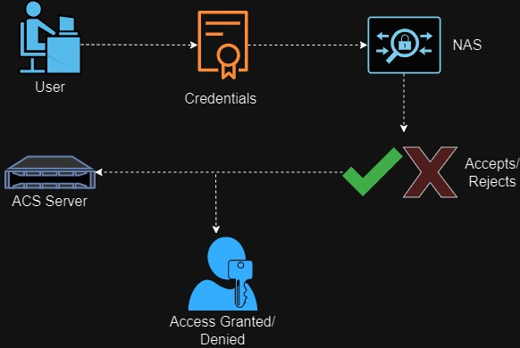

# Author: Rebecca Childs
## Reading Notes:
### Lab 08

### Explain each of the three A’s as you would to a non-technical family member. Use an analogy or a story.
Imagine your house Wi-Fi is a party. AAA makes sure the party goes smoothly:
Authentication (Checking IDs): AAA is like the bouncer checking everyone's ID (username and password) to see if they're invited (approved users). Crashers (unauthorized users) are kept out!
Authorization (Party Wristbands): Once someone's in, AAA acts like giving out colored wristbands. It checks what a user can do (permissions). A blue wristband might allow access to the internet (games), but not the printer (treats!).
Accounting (Keeping Track): AAA is like keeping a guest list. It tracks who's online (who's at the party) and what they're doing (downloading games) to ensure everything runs smoothly and nobody's doing anything strange.
So, AAA keeps the Wi-Fi party fun and secure by making sure only the right people get in (authentication), they can only do what's allowed (authorization), and everything is monitored (accounting).

### What should the administrator do if the ACS server fails to authenticate a user during AAA implementation?
If ACS fails to authenticate a user, the administrator should:
Check user credentials and network connectivity, review ACS logs for error messages, verify NAS configuration (IP, shared secrets, protocols), check for local backup authentication (if available), troubleshoot based on findings (reset passwords, adjust policies, etc.), and then seek additional help if needed.

### What is the role of the NAS in the AAA implementation using an ACS server? Use a diagram.
The NAS acts like a gatekeeper in AAA with ACS. It checks user credentials with the central authority (ACS server) to grant or deny access to network resources.

### What are the benefits of using RADIUS for authentication and authorization?
RADIUS simplifies managing user access to a network by centralizing authentication and authorization on a server. This offers better security, scalability, easier administration, and can integrate with existing systems.

### What is RADIUS and what does it stand for?
RADIUS stands for Remote Authentication Dial-In User Service. It's a networking protocol that centralizes authentication and authorization for network access, particularly WiFi.

### Research: What encryption algorithms does RADIUS use?
RADIUS doesn't encrypt everything, but it protects passwords. It uses a shared secret key and MD5 hashing to scramble passwords before sending them, making them hard to crack. However, to fully secure communication, extra layers like TLS or secure network connections are recommended.

## Things I want to learn more about:
N/A
